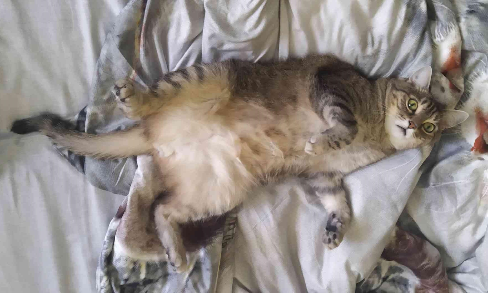

## Welcome 👋

## About me
- I love cats! 🐈
- Fueled by black tea 🍵
- Java enthusiast 💻
- Keyboard player 🎹
- Based in Poland 🇵🇱

Meet my cat:

## Minecraft
My work is strongly connected to the Minecraft ecosystem:
- I am a maintainer of [Quests](https://github.com/LMBishop/Quests) - a widely used plugin powering many servers, including well-known and high-traffic communities.
- I am the creator of [BlockTracker](https://modrinth.com/plugin/blocktracker), a high-performance block tracking solution already integrated with many other plugins.

I actively develop, maintain, and support my projects, focusing on performance, stability, and clean design.

## Visitors on this profile

